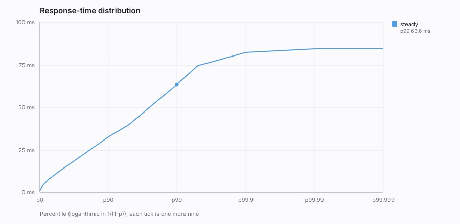

# Benchmark: open-loop-sweep

Fixed-arrival-rate steps from 500 to 6,000 requests/second, 30 seconds each. Latency is charged from each request's scheduled due time, so a client-side backlog is measured rather than hidden. Locate the knee, then read the admission-rate and queue-depth panels in Grafana for the same window to see which component became the constraint.

## Run

| | |
|---|---|
| Started | 2026-07-31 11:34:04 UTC |
| Target | `http://localhost:8080` |
| Scenario | open-loop-sweep |
| Skier population | 100,000 |
| Resort / season / day | 5 / 2025 / 1 |
| Max connections | 2,000 |
| Retry budget | 1 per request |
| JVM | 17.0.17 (OpenJDK 64-Bit Server VM) |
| Cores | 10 |

## Results

| Phase | Mode | Issued | OK | Failed | Wall (s) | Throughput (req/s) | p50 (ms) | p95 (ms) | p99 (ms) | p99.9 (ms) | Max (ms) |
|---|---|--:|--:|--:|--:|--:|--:|--:|--:|--:|--:|
| _warmup_ (warmup) | open loop | 2,000 | 2,000 | 0 | 10.0 | 199.5 | 2.85 | 7.49 | 22.32 | 73.22 | 81.86 |
| **500-rps** | open loop | 15,000 | 5,518 | 9,482 | 30.5 | 491.6 | 517.38 | 599.55 | 692.74 | 877.57 | 944.13 |
| **1000-rps** | open loop | 30,000 | 3,618 | 26,382 | 36.2 | 829.4 | 4,333.57 | 7,421.95 | 7,643.14 | 7,704.58 | 7,725.06 |
| **2000-rps** | open loop | 60,000 | 4,093 | 55,907 | 40.9 | 1,466.1 | 10,616.83 | 11,280.38 | 11,452.42 | 11,681.79 | 11,853.82 |
| **4000-rps** | open loop | 120,000 | 4,097 | 115,903 | 41.0 | 2,927.4 | 10,174.46 | 11,100.16 | 11,370.50 | 11,902.98 | 12,288.00 |
| **6000-rps** | open loop | 180,000 | 4,109 | 175,891 | 41.1 | 4,376.2 | 10,190.85 | 11,067.39 | 11,419.65 | 11,853.82 | 12,492.80 |

Warmup phases are excluded from every aggregate below.



## Little's Law cross-check

`L = λW`, so an independently sampled mean concurrency divided by the mean latency should reproduce the measured throughput. This is a **consistency check on the measurement**, not a second throughput result, both figures come from the same run, so agreement means the instrumentation is coherent and divergence means something was sampled badly.

| Phase | Mean concurrency (sampled) | Mean latency (ms) | Measured (req/s) | Little's Law (req/s) | Divergence |
|---|--:|--:|--:|--:|--:|
| 500-rps | 182.3 | 381.7 | 491.6 | 477.5 | 2.9% |
| 1000-rps | 3,550.0 | 4,297.1 | 829.4 | 826.1 | 0.4% |
| 2000-rps | 14,094.3 | 9,648.3 | 1,466.1 | 1,460.8 | 0.4% |
| 4000-rps | 29,249.6 | 10,040.4 | 2,927.4 | 2,913.2 | 0.5% |
| 6000-rps | 44,108.5 | 10,135.9 | 4,376.2 | 4,351.7 | 0.6% |

## Arrival-rate attainment

An open-loop phase is only valid if the generator kept its schedule. Attainment below ~98% means the client, not the server, was the constraint, latencies are still charged from each request's due time, so the numbers are not silently wrong, but the offered load was less than the label claims.

| Phase | Target (req/s) | Achieved (req/s) | Attainment |
|---|--:|--:|--:|
| warmup | 200 | 199.5 | 99.8% |
| 500-rps | 500 | 491.6 | 98.3% |
| 1000-rps | 1,000 | 829.4 | 82.9% |
| 2000-rps | 2,000 | 1,466.1 | 73.3% |
| 4000-rps | 4,000 | 2,927.4 | 73.2% |
| 6000-rps | 6,000 | 4,376.2 | 72.9% |

## Response codes

| Phase | Code | Count | Meaning |
|---|--:|--:|---|
| warmup | 201 | 2,000 | Created, broker accepted the event |
| 500-rps | 201 | 5,518 | Created, broker accepted the event |
| 500-rps | 429 | 9,482 | Shed by admission control |
| 1000-rps | 201 | 3,618 | Created, broker accepted the event |
| 1000-rps | 429 | 26,382 | Shed by admission control |
| 2000-rps | 201 | 4,093 | Created, broker accepted the event |
| 2000-rps | 429 | 28,538 | Shed by admission control |
| 2000-rps | 599 | 27,369 | Transport failure |
| 4000-rps | 201 | 4,097 | Created, broker accepted the event |
| 4000-rps | 429 | 27,225 | Shed by admission control |
| 4000-rps | 599 | 88,678 | Transport failure |
| 6000-rps | 201 | 4,109 | Created, broker accepted the event |
| 6000-rps | 429 | 25,806 | Shed by admission control |
| 6000-rps | 599 | 150,085 | Transport failure |

Retried attempts: 391,914 (attempts, not requests, a retried request is still one request).

## Percentile detail (measured phases)

| Percentile | Latency (ms) |
|---|--:|
| p50 | 10,133.50 |
| p75 | 10,633.22 |
| p90 | 10,862.59 |
| p95 | 11,165.70 |
| p99 | 11,386.88 |
| p99.9 | 11,821.06 |
| p99.99 | 12,361.73 |
| p100 | 12,492.80 |

## How to reproduce

```bash
make up
java -jar Client/SkierClient/target/skier-client.jar run \
  --scenario benchmarks/scenarios/open-loop-sweep.yaml \
  --base-url http://localhost:8080 \
  --out benchmarks/out
```

## Caveats

- Latency is measured client-side and includes network time to the target.
- A `201` means the broker accepted the event, not that it is queryable. End-to-end pipeline lag is a separate measurement.
- Open-loop phases use uniform, not Poisson, arrivals; real traffic is burstier, so queueing here is understated.
- Retries are included in a request's measured latency, which is what a client experiences, but it means a run with many retries has a heavier tail than the server's own per-request timing would show.
